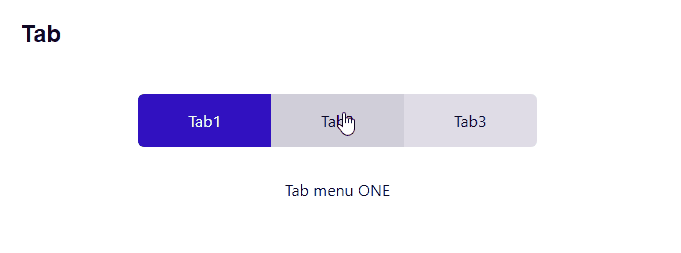
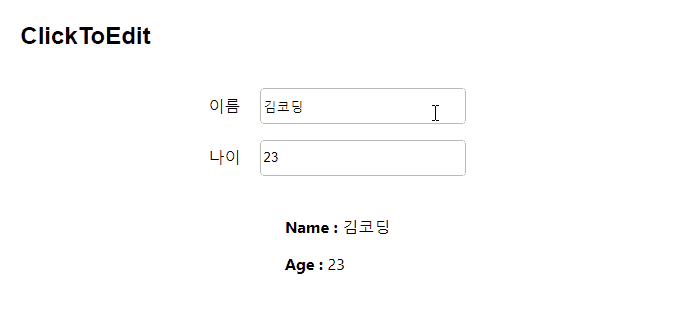

# wanted_pre_onboarding

> 원티드 프리온보딩 코스_프론트엔드 과제


## 실행 방법

1. 우측 상단 code -> Download Zip을 클릭해 zip 파일을 다운받습니다. (또는 HTTPS를 복사해 git bash를 통해 clone 합니다. `git clone https주소`)
2. 압축 파일을 해제합니다.
3. VS Code 또는 git bash로 실행 후 `npm install`을 입력해 필요한 파일을 설치합니다.
4. 그 후  `npm start` 를 입력해 로컬 호스트를 실행합니다. 
   ( [http://localhost:3000](http://localhost:3000/) )


## 구현 목록

### Modal


- 구현한 방법 & 이유

  ```
  
  ```

  

- 어려웠던 점 & 해결 방법

  ```
  
  ```

  

### Tolggle


- 구현한 방법 & 이유

  ```
  
  ```

  

- 어려웠던 점 & 해결 방법

  ```
  
  ```

  

### Tab



- 구현한 방법 & 이유

  ```
  
  ```

  

- 어려웠던 점 & 해결 방법

  ```
  
  ```

  

### ClickToEdit



- 구현한 방법 & 이유

  ```
  
  ```

  

- 어려웠던 점 & 해결 방법

  ```
  
  ```

  

### AutoComplete

- 구현한 방법 & 이유

  ```
  
  ```

  

- 어려웠던 점 & 해결 방법

  ```
  - 어려웠던 거.. 오토 컴플릿에서
  - 한글 자음만 해도 검색하는게 안됨
  - 중간에 낀 단어는 검색이 안됨..
  ```

  

### Tag

- 구현한 방법 & 이유

  ```
  
  ```

  

- 어려웠던 점 & 해결 방법

  ```
  
  ```

  

- 태그
- input에 enter만 쳤는데 자꾸 태그가 저절로 삭제됨
- x 버튼을 누르지도 않았는데?
- `onClick={deleteTag(idx)}` 를 `onClick={() => deleteTag(idx)}`로 수정했더니 됐다.. ㅁ무슨 차이지?