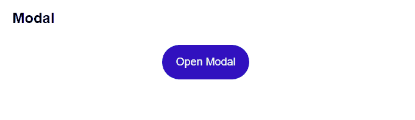

# wanted_pre_onboarding

> 원티드 프리온보딩 코스_프론트엔드 과제


## 실행 방법

1. 우측 상단 code -> Download Zip을 클릭해 zip 파일을 다운받습니다. (또는 HTTPS를 복사해 git bash를 통해 clone 합니다. `git clone https주소`)
2. 압축 파일을 해제합니다.
3. VS Code 또는 git bash로 실행 후 `npm install`을 입력해 필요한 파일을 설치합니다.
4. 그 후  `npm start` 를 입력해 로컬 호스트를 실행합니다. 
   ( [http://localhost:3000](http://localhost:3000/) )


## 구현 목록

### Tolggle


- 구현한 방법 & 이유

  ```
  toggle을 처음 생각할때 div나 button으로 만드는거라 생각했지만, 그 접근방식으론 잘 되지 않아 접근 방식을 다시 생각했습니다. on/off의 두가지를 구분해야하고, 반복적으로 상태 변화를 줄 수 있어야하기 때문에 input의 checkbox로 변경했습니다. 여기에 input의 id와 연결시켜 활용할 수 있는 label 태그를 사용해 그 안에 토글 스위치 버튼을 넣어두었습니다.
  on/off 상태를 useState에 true/false로 저장해 CSS class명에 활용해 상태에 따라 배경색을 변경했습니다.
  ```

  

- 어려웠던 점 & 해결 방법

  ```
  처음엔 on/off 상태에 따라 움직이는 버튼을 js로 구현해야하나 고민했는데, 의외로 CSS에서 :checked와 transform: translateX()를 통해 쉽게 구현할 수 있었습니다.
  ```

  

### Modal



- 구현한 방법 & 이유

  ```
  모달 창을 div로 따로 만들어 모달 버튼을 클릭했을 시에만 보이도록 구현했습니다. 평소에는 display: none 속성을 주어 가려두고, 버튼 클릭 이벤트 발생시 display: flex로 모든 화면을 감싸 덮도록 했습니다. z-index 값으로 화면 최상단에 위치하도록 했고 margin-top에 20vh 값을 주어 화면을 줄여도 늘 상단에서부터 20% 정도에 위치하도록 했습니다.
  ```

  

- 어려웠던 점 & 해결 방법

  ```
  컨텐츠 이외의 영역을 클릭했을 시에도 닫히게 하고 싶었지만 처음에 구상할때 그 부분을 미처 신경쓰지 못해 구현하지 못했습니다. 화면에서 모달 컴포넌트만을 인식해 그 외의 영역을 클릭하면 닫히게 하는 법에 대해서도 고민이 필요할것 같습니다.
  ```

  

### Tab


- 구현한 방법 & 이유

  ```
  tab 이름과 내용을 리스트 배열에 넣어두고 그 내용을 map() 메서드를 통해 화면에 보이도록 했습니다. index 값을 받아와 현재 보이고 있는 index 값이 내가 클릭한 것과 일치할 경우 active 되어있다는 것을 표시하기 위해 배경색을 다르게 표시했습니다. 
  ```

  

- 어려웠던 점 & 해결 방법

  ```
  현재 보고 있는 탭을 표시하는 방법을 어떻게 구현할지 고민했습니다. index를 활용해 내가 현재 보고 있는 탭은 다른 class명을 주어 CSS를 다르게 부여했습니다. 기본 값을 0으로 설정해두어 첫 화면엔 첫번째 tab이 보이게 해두었습니다.
  ```

  

### ClickToEdit


- 구현한 방법 & 이유

  ```
  처음엔 input의 값이 변경되었을때 target.value 값을 아래에 바로 출력하도록 구현했습니다. 하지만 예시의 이미지와 다른 방식으로 작동하는 것을 깨닫고 구현 방식을 변경했습니다. input의 focus를 벗어났을 경우 값을 새로 update해야하기 때문에 onFocus와 onBlur로 이벤트를 핸들링했습니다. 
  ```

  

- 어려웠던 점 & 해결 방법

  ```
  onBlur를 활용해본적이 없었어서 접근 방식을 달리 생각하는게 조금 어려웠습니다. useRef로 따로 값을 관리하는건가 생각했지만 onBlur를 통해 생각보다 쉽게 값을 변경할 수 있었습니다.
  ```

  

### AutoComplete


- 구현한 방법 & 이유

  ```
  데이터를 배열에 미리 넣어두고 사용자가 검색어를 입력했을때 그에 맞는 추천 단어를 map() 메서드를 통해 리스트로 보여주도록 했습니다.
  값이 없을 경우는 display 값을 none으로 해두어 추천단어 목록을 보이지 않게하고, list안에 값이 하나라도 있을 경우 display 속성을 block으로 변경해 보이도록 했습니다. 추천단어 목록 보여주기 여부를 true/false로 관리해 그에 따라 CSS를 변경했습니다.
  ```

  

- 어려웠던 점 & 해결 방법

  ```
  display: none과 visibility: hidden 중, 후자는 추천 단어창의 높이만큼 아래에 공간이 남게되어 display로 화면 표시 여부를 정했습니다.
  한글 자음만 입력했을때도 검색하도록 하고 싶었지만, 그 부분은 좀더 고민이 필요할 것 같습니다.
  ```

  

### Tag


- 구현한 방법 & 이유

  ```
  버튼 없이 엔터키를 눌렀을때 태그가 추가되어야하기 때문에 onKeyPress를 통해 태그 업데이트를 관리했습니다. 빈값이 추가되지 않도록 value.length를 검사하고, key 값이 enter인 경우에만 업데이트 되도록 했습니다.
  입력한 태그는 배열에 담아 useState로 업데이트를 관리했습니다. tag를 삭제할땐 slice() 메서드로 새 배열을 만들고, 새 배열에서 splice를 통해 수정 후 배열을 저장했습니다. 또한 flex로 tag 개수가 늘어나면 높이값이 저절로 조절되도록 했습니다.
  ```

  

- 어려웠던 점 & 해결 방법

  ```
  input에 엔터 쳤을때 태그가 추가된 뒤 저절로 삭제되는 현상이 발생해 디버깅했습니다. 삭제 버튼을 눌렀을 때에만 deleteTag 함수가 실행되도록 onClick={deleteTag(idx)}를 onClick={() => deleteTag(idx)}로 수정해 문제를 해결했습니다.
  ```
